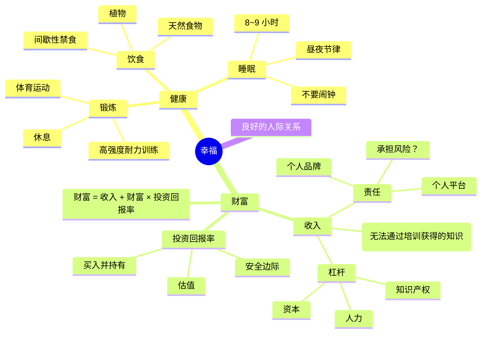

---
title:
publish: "false"
category: 文章写作
date: 2025-12-03
alias: " 1t6gf61kmszrv07h10y3"
tags:
---
纳瓦尔幸福公式

![[Pasted image 20251203141521.png]]

```mermaid
mindmap
  root((幸福))
    健康
      锻炼
        高强度耐力训练
        体育运动
        休息
      饮食
        天然食物
        间歇性禁食
        植物
      睡眠
        不要闹钟
        8~9 小时
        昼夜节律
    财富
        收入
          责任
            个人品牌
            个人平台
            承担风险？
          杠杆
            资本
            人力
            知识产权
          专长(无法通过培训获得的知识)
        投资回报率
          买入并持有
          估值
          安全边际
      财富 = 收入 + 财富 × 投资回报率
    良好的人际关系
```

